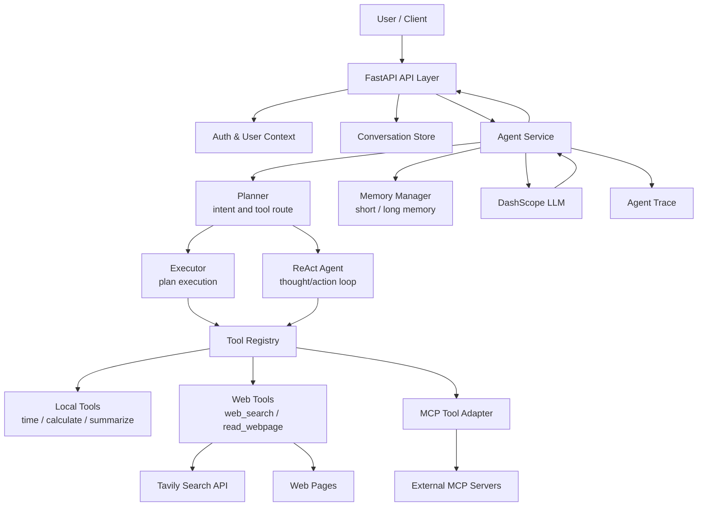
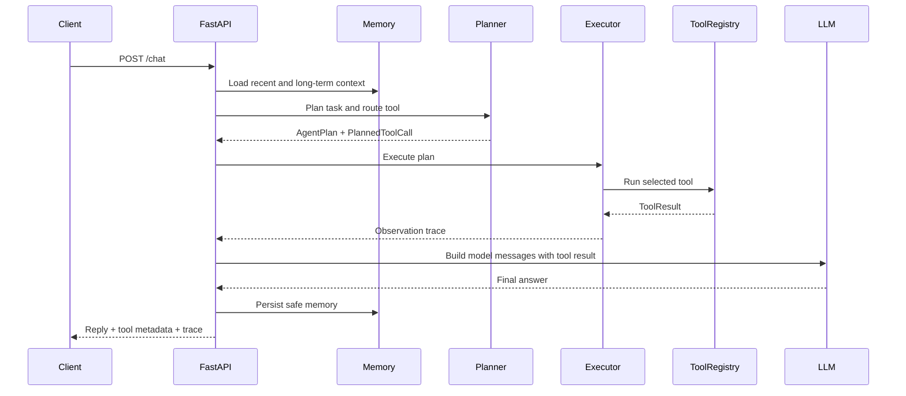

# AgentOS

## 项目简介

一个基于 **FastAPI + DashScope/OpenAI-Compatible API** 的工程化 Agent 智能体框架。项目围绕「任务规划、工具调用、网页检索、记忆管理、执行轨迹、流式响应」构建，提供可运行、可扩展、可观测的智能体后端，并内置一个轻量 Web UI 用于本地调试和演示。

AgentOS 不是一次性的聊天 Demo，而是一个面向真实应用集成的 Agent Runtime：你可以在统一的工具注册表中扩展能力，在 Planner/Executor/ReAct/Reflector 链路中调整智能体行为，并通过 FastAPI 接口把 Agent 能力暴露给前端、业务系统或其他服务。

## 核心特性

- **工程化 Agent 分层**：Planner、Executor、Reactor、Reflector、State 独立拆分，便于测试、替换和扩展。
- **统一工具系统**：所有工具通过 `ToolRegistry` / `ToolManager` 注册和调用，返回标准化 `ToolResult`。
- **联网研究工作流**：支持 Tavily Web Search、网页正文读取、搜索结果整理和模型总结。
- **MCP 工具接入**：可通过配置接入外部 MCP Server，并将 MCP 能力包装为本地工具。
- **短期与长期记忆**：内置 JSON 存储的会话短期记忆和用户长期记忆检索。
- **Agent Trace 可观测性**：每次请求可返回 planner、tool_call、observation、final_answer 等执行轨迹。
- **流式响应**：`/chat/stream` 基于 Server-Sent Events 输出状态、文本片段、元数据和完成事件。
- **认证与会话隔离**：支持注册、登录、JWT 鉴权，以及按用户隔离的 conversation/document 数据。
- **多存储选项**：会话默认内存存储，也支持 SQLite 和 SQLAlchemy 数据库 URL。
- **前端调试界面**：内置原生 HTML/CSS/JavaScript UI，可直接访问 `/ui` 体验 Agent。

## 技术栈

| 模块 | 技术 |
| --- | --- |
| Web Framework | FastAPI, Uvicorn |
| LLM Provider | DashScope OpenAI-Compatible API |
| Schema & Config | Pydantic, Pydantic Settings |
| Persistence | SQLite, SQLAlchemy, JSON |
| Tooling | Custom ToolRegistry, MCP Adapter, Tavily Search |
| Frontend | Vanilla HTML, CSS, JavaScript |
| Testing | Pytest |
| Migration | Alembic |

## 系统架构图



## Agent 执行流程



典型步骤：

1. API 层接收请求，完成鉴权、会话读取和上下文组装。
2. Memory Manager 注入相关历史记忆和近期对话。
3. Planner 基于用户意图生成结构化 `AgentPlan`，并判断是否需要工具。
4. Executor 按计划调用工具，工具统一通过 `ToolRegistry` 执行。
5. 搜索类任务会进入 Web Search -> Read Webpage -> Summarize 的研究工作流。
6. LLM 接收用户输入、历史上下文和工具观察结果，生成最终回答。
7. API 返回回答、工具元数据和 Agent Trace，流式接口则持续推送状态事件。

## 目录结构

```text
.
├── backend/
│   └── app/
│       ├── main.py                 # FastAPI application factory and runtime entry
│       ├── api/                    # HTTP routes: auth, chat, documents, mcp
│       ├── core/                   # config, logging, exceptions, safe logging
│       ├── agent/                  # planner, executor, reactor, reflector, state
│       ├── tools/                  # tool base, registry, web search, webpage reader
│       ├── memory/                 # short memory, long memory, memory manager
│       ├── services/               # orchestration, LLM client, stores, workflows
│       ├── schemas/                # request and response schemas
│       ├── config/                 # settings exports
│       ├── mcp/                    # MCP client, manager, router and server config
│       └── workflow/               # reusable workflow graph and research workflow
├── app/                            # backward-compatible import namespace
├── frontend/                       # local web UI
├── scripts/                        # MCP and search test utilities
├── tests/                          # unit and API tests
├── alembic/                        # database migrations
├── main.py                         # compatibility entry for uvicorn main:app
├── requirements.txt
├── pyproject.toml
└── README.md
```

## 快速开始

### 1. 创建虚拟环境

Windows:

```bash
python -m venv .venv
.venv\Scripts\activate
```

macOS / Linux:

```bash
python -m venv .venv
source .venv/bin/activate
```

### 2. 安装依赖

```bash
pip install -r requirements.txt
```

开发和测试依赖：

```bash
pip install pytest ruff mypy
```

### 3. 配置环境变量

```bash
copy .env.example .env
```

macOS / Linux:

```bash
cp .env.example .env
```

至少需要配置：

```env
API_KEY=your_model_api_key_here
BASE_URL=https://dashscope.aliyuncs.com/compatible-mode/v1
MODEL_NAME=qwen-plus
AUTH_ENABLED=false
```

如果需要联网搜索，还需要配置：

```env
SEARCH_API_KEY=your_tavily_api_key_here
WEB_SEARCH_PROVIDER=tavily
```

### 4. 启动服务

推荐使用新的后端入口：

```bash
uvicorn backend.app.main:app --reload
```

兼容旧入口：

```bash
uvicorn main:app --reload
```

也可以直接运行：

```bash
python main.py
```

启动后访问：

- Web UI: <http://127.0.0.1:8000/ui>
- API Docs: <http://127.0.0.1:8000/docs>
- Health Check: <http://127.0.0.1:8000/>

### 5. 运行测试

```bash
pytest
```

或使用项目虚拟环境：

```bash
.venv\Scripts\python.exe -m pytest
```

## 环境变量说明

| 变量 | 默认值 | 说明 |
| --- | --- | --- |
| `API_KEY` | - | 模型服务 API Key，兼容 `DASHSCOPE_API_KEY` |
| `BASE_URL` | `https://dashscope.aliyuncs.com/compatible-mode/v1` | OpenAI-Compatible API 地址 |
| `MODEL_NAME` | `qwen-plus` | 默认模型名称，兼容 `DASHSCOPE_MODEL` |
| `MODEL_TIMEOUT_SECONDS` | `60` | 模型请求超时时间 |
| `MAX_AGENT_STEPS` | `8` | 单次 Agent 计划最大步骤数 |
| `CORS_ALLOW_ORIGINS` | `http://127.0.0.1:8000,http://localhost:8000` | 允许跨域来源 |
| `CONVERSATION_STORE` | `memory` | 会话存储类型：`memory` 或 `sqlite` |
| `CONVERSATION_DB_PATH` | `data/conversations.db` | SQLite 会话数据库路径 |
| `CONVERSATION_DATABASE_URL` | - | SQLAlchemy 数据库 URL，可接 PostgreSQL/MySQL |
| `CONVERSATION_MAX_ROUNDS` | `30` | 每个会话保留的最大轮数 |
| `DOCUMENT_DB_PATH` | `data/documents.db` | 文档索引数据库路径 |
| `DOCUMENT_UPLOAD_MAX_BYTES` | `5242880` | 文档上传大小限制 |
| `AUTH_ENABLED` | `false` | 是否启用 JWT 鉴权 |
| `AUTH_DB_PATH` | `data/auth.db` | 用户认证数据库路径 |
| `AUTH_JWT_SECRET` | `change-this-local-development-secret` | JWT 签名密钥，生产环境必须替换 |
| `AUTH_TOKEN_EXPIRE_MINUTES` | `1440` | JWT 有效期 |
| `AUTH_DEV_USER_ID` | `__dev__` | 关闭鉴权时使用的开发用户 ID |
| `AUTO_OPEN_BROWSER` | `true` | `python main.py` 启动时是否自动打开浏览器 |
| `SEARCH_API_KEY` | - | Tavily 搜索 API Key，兼容 `TAVILY_API_KEY` |
| `WEB_SEARCH_PROVIDER` | `tavily` | 搜索服务提供商 |
| `WEB_SEARCH_TIMEOUT_SECONDS` | `5` | 搜索工具超时时间 |
| `WEB_READER_TIMEOUT_SECONDS` | `5` | 网页读取工具超时时间 |
| `SEARCH_WORKFLOW_READ_TOP_K` | `2` | 搜索工作流最多读取的网页数量 |
| `MEMORY_PATH` | `data/memories.json` | 记忆 JSON 存储路径 |
| `MEMORY_SEARCH_LIMIT` | `5` | 长期记忆检索数量 |
| `MEMORY_RECENT_CONTEXT_LIMIT` | `6` | 注入模型的近期上下文数量 |
| `MCP_ENABLED` | `true` | 是否启用 MCP 工具适配 |
| `MCP_DEFAULT_SERVER` | `modelscope` | 默认 MCP Server 名称 |
| `MODELSCOPE_API_TOKEN` | - | ModelScope 相关服务 Token |
| `MODELSCOPE_MCP_URL` | `http://127.0.0.1:8001/mcp` | ModelScope MCP Server 地址 |
| `TOOL_TIMEOUT_SECONDS` | `60` | 工具/MCP 请求超时时间，兼容 `MCP_TIMEOUT_SECONDS` |

## Docker 部署

如果项目中尚未提交 Dockerfile，可以使用下面的生产化基础模板。

### Dockerfile

```dockerfile
FROM python:3.11-slim

WORKDIR /app

ENV PYTHONDONTWRITEBYTECODE=1
ENV PYTHONUNBUFFERED=1

COPY requirements.txt .
RUN pip install --no-cache-dir -r requirements.txt

COPY . .

EXPOSE 8000

CMD ["uvicorn", "backend.app.main:app", "--host", "0.0.0.0", "--port", "8000"]
```

### docker-compose.yml

```yaml
services:
  agentos:
    build: .
    ports:
      - "8000:8000"
    env_file:
      - .env
    volumes:
      - ./data:/app/data
      - ./logs:/app/logs
    restart: unless-stopped
```

### 构建与启动

```bash
docker compose up --build -d
```

查看日志：

```bash
docker compose logs -f agentos
```

停止服务：

```bash
docker compose down
```

## API 示例

### 健康检查

```bash
curl http://127.0.0.1:8000/
```

响应示例：

```json
{
  "status": "ok",
  "message": "DashScope Agent is running"
}
```

### 用户注册与登录

当 `AUTH_ENABLED=true` 时，需要先注册或登录并携带 Bearer Token。

```bash
curl -X POST http://127.0.0.1:8000/auth/register \
  -H "Content-Type: application/json" \
  -d "{\"username\":\"alice\",\"password\":\"password123\"}"
```

```bash
curl -X POST http://127.0.0.1:8000/auth/login \
  -H "Content-Type: application/json" \
  -d "{\"username\":\"alice\",\"password\":\"password123\"}"
```

### 普通聊天

```bash
curl -X POST http://127.0.0.1:8000/chat \
  -H "Content-Type: application/json" \
  -d "{\"message\":\"帮我计算 23 * 17 + 8 等于多少\",\"conversation_id\":\"demo\"}"
```

响应示例：

```json
{
  "success": true,
  "reply": "23 * 17 + 8 = 399。",
  "model": "qwen-plus",
  "conversation_id": "demo",
  "used_tool": true,
  "tool_name": "calculate",
  "tool_status": "success",
  "tool_result": {
    "expression": "23 * 17 + 8",
    "value": 399
  },
  "tool_error": null,
  "tool_duration_ms": 1.24,
  "trace": []
}
```

### 流式聊天

```bash
curl -N -X POST http://127.0.0.1:8000/chat/stream \
  -H "Content-Type: application/json" \
  -d "{\"message\":\"搜索 qwen-plus 的最新资料并总结\",\"conversation_id\":\"research-demo\"}"
```

SSE 事件类型包括：

- `status`：工具调用、联网搜索、网页读取等阶段状态。
- `metadata`：模型、会话、工具和 trace 元数据。
- `chunk`：模型生成的文本片段。
- `done`：回答完成事件。
- `error`：异常事件。

### 会话管理

```bash
curl http://127.0.0.1:8000/conversations
```

```bash
curl http://127.0.0.1:8000/conversations/demo/messages
```

```bash
curl -X DELETE http://127.0.0.1:8000/conversations/demo
```

### 文档问答

```bash
curl -X POST http://127.0.0.1:8000/documents/upload \
  -F "file=@notes.txt"
```

```bash
curl -X POST http://127.0.0.1:8000/documents/{document_id}/ask \
  -H "Content-Type: application/json" \
  -d "{\"question\":\"总结这份文档的关键结论\"}"
```

### MCP 健康检查

```bash
curl http://127.0.0.1:8000/mcp/health
```

## Agent Trace 示例

AgentOS 会将关键执行阶段序列化为稳定的 trace，便于前端展示、日志分析和问题排查。

```json
[
  {
    "step": "planner",
    "status": "success",
    "message": "Selected tool: web_search.",
    "tool_name": "web_search",
    "duration_ms": 2.18,
    "metadata": {
      "route_score": 90,
      "route_reason": "检测到最新/搜索/官网/github等关键词",
      "plan": {
        "question": "搜索 qwen-plus 的最新资料并总结",
        "steps": [
          {
            "step_id": "tool_1",
            "description": "Call the web_search tool with the planned arguments.",
            "tool_name": "web_search",
            "tool_args": {
              "query": "搜索 qwen-plus 的最新资料并总结",
              "max_results": 3,
              "search_depth": "basic"
            },
            "depends_on": []
          },
          {
            "step_id": "final_answer",
            "description": "Generate the final answer from the available context and tool result.",
            "tool_name": null,
            "tool_args": {},
            "depends_on": ["tool_1"]
          }
        ]
      }
    }
  },
  {
    "step": "tool_call",
    "status": "success",
    "message": "Tool call finished: web_search",
    "tool_name": "web_search",
    "duration_ms": 482.31,
    "metadata": {
      "tool_args": {
        "query": "搜索 qwen-plus 的最新资料并总结",
        "max_results": 3,
        "search_depth": "basic"
      }
    }
  },
  {
    "step": "observation",
    "status": "success",
    "message": "Observed tool result.",
    "tool_name": "web_search",
    "observation": {
      "name": "web_search",
      "success": true,
      "result": {
        "query": "搜索 qwen-plus 的最新资料并总结",
        "results": [
          {
            "title": "Example Result",
            "url": "https://example.com",
            "content": "Search result snippet..."
          }
        ]
      },
      "duration_ms": 482.31
    }
  },
  {
    "step": "final_answer",
    "status": "success",
    "duration_ms": 1320.52
  }
]
```

Trace 中常见字段：

| 字段 | 说明 |
| --- | --- |
| `step` | 执行阶段，例如 `planner`、`tool_call`、`observation`、`final_answer` |
| `status` | 阶段状态：`running`、`success`、`failed`、`skipped` |
| `tool_name` | 当前阶段关联的工具名称 |
| `duration_ms` | 阶段耗时 |
| `metadata` | 计划、路由原因、工具参数等调试信息 |
| `observation` | 工具执行结果或执行观察 |

## 后续规划 Roadmap

- [ ] 支持模型原生 Function Calling / Tool Calling，并保留当前规则路由作为 fallback。
- [ ] 引入向量数据库，增强长期记忆和知识库检索能力。
- [ ] 为 Agent Trace 增加持久化检索、前端时间线和失败重放能力。
- [ ] 将 ToolRegistry 扩展为插件化工具市场，支持动态加载和权限控制。
- [ ] 支持多 Agent 协作编排，包括 researcher、coder、reviewer 等专业角色。
- [ ] 增加任务队列和后台执行模式，支持长任务、异步回调和定时任务。
- [ ] 完善 Dockerfile、Compose、健康检查和生产部署配置。
- [ ] 增加 OpenTelemetry 指标、结构化日志和链路追踪。
- [ ] 扩展文档问答能力，支持 PDF、DOCX、Markdown 和多文件知识库。
- [ ] 增强安全策略，包括工具沙箱、参数脱敏、速率限制和用户级权限。
