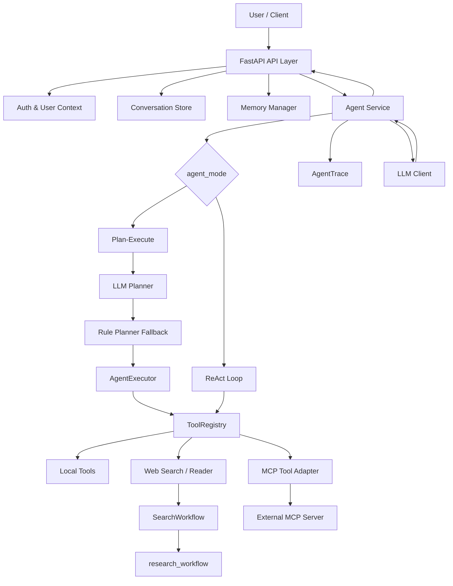

# AgentOS

## 项目简介

AgentOS 是一个基于 **FastAPI + DashScope/OpenAI-Compatible API** 的工程化 Agent 后端示例。当前代码围绕任务规划、工具调用、执行轨迹、记忆、MCP 工具适配、多 Agent 路由和流式聊天构建，并提供一个轻量 Web UI 用于本地调试。

这个项目不是完整的生产级 Agent 平台。README 只描述当前代码中已经存在或正在实验的能力；Reflector、通用 Workflow 编排、任务队列、插件市场、OpenTelemetry 等没有接入主链路的内容不会写成已完成能力。

> 注意：仓库里同时保留了 `app/` 和 `backend/app/` 两套相近命名空间。新增能力主要集中在顶层 `app/` 主实现；`backend/app` 中有兼容入口和部分镜像文件，个别文件可能滞后。部署前请以实际启动入口和 OpenAPI schema 为准。

## 当前能力边界

### 已实现能力

- **LLM Planner**：`app.agent.planner.LLMPlanGenerator` 会让模型生成结构化 `AgentPlan` JSON，并用 Pydantic、依赖顺序和 `ToolRegistry.list_tools()` 校验计划；失败时回退到规则规划。
- **Plan-Execute**：默认执行模式是规划 -> `AgentExecutor` -> `ToolRegistry` -> 工具观察结果 -> LLM 最终回答。
- **ReAct Loop**：`app.agent.reactor.ReActAgent` 实现 Thought / Action / Observation / Final Answer 循环，并通过 `agent_mode="react"` 在 AgentService 中接入。
- **ToolRegistry**：统一注册、列举和执行工具，返回标准化 `ToolResult`，并包含错误分类、重试标记和耗时信息。
- **AgentTrace**：聊天接口和 Agent 服务会记录 planner、tool_call、observation、thought、final_answer 等步骤，便于前端展示和排查问题。
- **Memory**：`MemoryManager` 提供 JSON 存储的短期会话上下文和长期用户记忆；可选开启本地向量相似度检索。
- **MCP Tool Adapter**：`MCPTool`、`MCPManager`、`MCPRouter` 支持把外部 MCP Server 的工具包装成本地工具调用。
- **Multi-Agent Router**：`ManagerAgent` 可以按任务路由到 `SearchAgent`、`SummaryAgent`、`CodeAgent`，再聚合子 Agent 结果。
- **Streaming Chat**：`/chat/stream` 使用 Server-Sent Events 输出状态、元数据、文本 chunk、完成事件和错误事件。

### 实验性能力

- **Reflector**：`backend/app/agent/reflector.py` 中有轻量 trace 反思器，但当前没有接入 `/chat` 或 `/chat/stream` 主链路，因此属于实验性模块。
- **Workflow**：`app.workflow` 提供 DAG 执行器，`SearchWorkflow` 会在搜索场景内部使用 `research_workflow`；但通用 Workflow 编排还没有作为公开 Agent 主链路或 API 暴露，暂按实验性能力处理。
- **向量记忆**：`MEMORY_VECTOR_ENABLED=true` 后会为长期记忆生成 embedding 并在 JSON 记忆条目中保存向量，再用本地余弦相似度检索。它不是独立向量数据库，也没有向量库持久化服务。
- **backend/app 同步状态**：`backend/app` 保留兼容入口，主要用于兼容 `main:app` 启动路径；新增 Agent 模式字段需要继续保持两套命名空间同步。

### Roadmap

- 将 Reflector 接入主链路，并在 API trace 中返回反思结果。
- 明确 `app/` 与 `backend/app/` 的单一运行入口，消除兼容层滞后。
- 将通用 Workflow 编排暴露为稳定 API 或 Agent 可调用能力。
- 为 Agent Trace 增加持久化检索、前端时间线和失败重放。
- 增加生产级部署文件、健康检查、观测指标和更细粒度的工具权限控制。

## 技术栈

| 模块 | 技术 |
| --- | --- |
| Web Framework | FastAPI, Uvicorn |
| LLM Provider | DashScope / OpenAI-Compatible API |
| Schema & Config | Pydantic, Pydantic Settings |
| Persistence | JSON, SQLite, SQLAlchemy |
| Tooling | ToolRegistry, MCP Adapter, Tavily Search |
| Frontend | Vanilla HTML, CSS, JavaScript |
| Testing | Pytest |
| Migration | Alembic |

## 架构概览



## Agent 执行流程

默认 `plan_execute` 流程：

1. API 层接收请求，完成鉴权、会话读取和消息组装。
2. Memory Manager 注入相关长期记忆和当前会话近期上下文。
3. LLM Planner 尝试生成结构化 `AgentPlan`；计划无效时回退到规则路由。
4. AgentExecutor 按计划调用工具，工具统一通过 ToolRegistry 执行。
5. 搜索类任务会进入 SearchWorkflow，内部执行搜索、读取网页和整理上下文。
6. LLM 基于用户输入、历史上下文和工具观察结果生成最终回答。
7. API 返回回答、工具元数据和 AgentTrace；流式接口持续推送 SSE 事件。

`react` 流程：

1. ReActAgent 要求模型按 JSON 格式输出 thought、action、action_args 或 final_answer。
2. 每次 action 只能调用已注册工具。
3. 工具结果以 Observation 形式追加到 scratchpad。
4. 达到 final_answer 或最大工具调用次数后结束。

## 目录结构

```text
.
├── app/                            # 当前主要实现：agent、api、services、tools、memory、mcp、workflow
├── backend/
│   └── app/                        # 兼容入口和部分镜像模块
├── frontend/                       # 本地 Web UI
├── scripts/                        # MCP、搜索和连接测试脚本
├── tests/                          # 单元测试和 API 测试
├── alembic/                        # 数据库迁移
├── main.py                         # 兼容启动入口
├── requirements.txt
├── pyproject.toml
└── README.md
```

## 快速开始

### 1. 创建虚拟环境

Windows:

```bash
python -m venv .venv
.venv\Scripts\activate
```

macOS / Linux:

```bash
python -m venv .venv
source .venv/bin/activate
```

### 2. 安装依赖

```bash
pip install -r requirements.txt
```

开发和测试依赖：

```bash
pip install pytest ruff mypy
```

### 3. 配置环境变量

Windows:

```bash
copy .env.example .env
```

macOS / Linux:

```bash
cp .env.example .env
```

至少需要配置：

```env
API_KEY=your_model_api_key_here
BASE_URL=https://dashscope.aliyuncs.com/compatible-mode/v1
MODEL_NAME=qwen-plus
AUTH_ENABLED=false
```

如果需要联网搜索，还需要配置：

```env
SEARCH_API_KEY=your_tavily_api_key_here
WEB_SEARCH_PROVIDER=tavily
```

### 4. 启动服务

兼容入口：

```bash
uvicorn main:app --reload
```

也可以直接运行：

```bash
python main.py
```

启动后访问：

- Web UI: <http://127.0.0.1:8000/ui>
- API Docs: <http://127.0.0.1:8000/docs>
- Health Check: <http://127.0.0.1:8000/>

### 5. 运行测试

```bash
pytest
```

或使用项目虚拟环境：

```bash
.venv\Scripts\python.exe -m pytest
```

## 环境变量说明

| 变量 | 默认值 | 说明 |
| --- | --- | --- |
| `API_KEY` | - | 模型服务 API Key，兼容 `DASHSCOPE_API_KEY` |
| `BASE_URL` | `https://dashscope.aliyuncs.com/compatible-mode/v1` | OpenAI-Compatible API 地址 |
| `MODEL_NAME` | `qwen-plus` | 默认模型名称，兼容 `DASHSCOPE_MODEL` |
| `MODEL_TIMEOUT_SECONDS` | `30` | 模型请求超时时间 |
| `MAX_AGENT_STEPS` | `8` | 单次 Agent 计划或 ReAct 工具调用的最大步数 |
| `CORS_ALLOW_ORIGINS` | `http://127.0.0.1:8000,http://localhost:8000` | 允许跨域来源 |
| `CONVERSATION_STORE` | `memory` | 会话存储类型：`memory` 或 `sqlite` |
| `CONVERSATION_DB_PATH` | `data/conversations.db` | SQLite 会话数据库路径 |
| `CONVERSATION_DATABASE_URL` | - | SQLAlchemy 数据库 URL |
| `CONVERSATION_MAX_ROUNDS` | `30` | 每个会话保留的最大轮数 |
| `DOCUMENT_DB_PATH` | `data/documents.db` | 文档索引数据库路径 |
| `DOCUMENT_UPLOAD_MAX_BYTES` | `5242880` | 文档上传大小限制 |
| `AUTH_ENABLED` | `true` | 是否启用 JWT 鉴权 |
| `AUTH_DB_PATH` | `data/auth.db` | 用户认证数据库路径 |
| `AUTH_JWT_SECRET` | `change-this-local-development-secret` | JWT 签名密钥，生产环境必须替换 |
| `AUTH_TOKEN_EXPIRE_MINUTES` | `1440` | JWT 有效期 |
| `AUTH_DEV_USER_ID` | `__dev__` | 关闭鉴权时使用的开发用户 ID |
| `AUTO_OPEN_BROWSER` | `true` | `python main.py` 启动时是否自动打开浏览器 |
| `SEARCH_API_KEY` | - | Tavily 搜索 API Key，兼容 `TAVILY_API_KEY` |
| `WEB_SEARCH_PROVIDER` | `tavily` | 搜索服务提供商 |
| `WEB_SEARCH_TIMEOUT_SECONDS` | `5` | 搜索工具超时时间 |
| `WEB_READER_TIMEOUT_SECONDS` | `5` | 网页读取工具超时时间 |
| `SEARCH_WORKFLOW_READ_TOP_K` | `2` | 搜索工作流最多读取的网页数量 |
| `MEMORY_PATH` | `data/memories.json` | 记忆 JSON 存储路径，兼容 `MEMORY_JSON_PATH` |
| `MEMORY_SEARCH_LIMIT` | `5` | 长期记忆检索数量 |
| `MEMORY_RECENT_CONTEXT_LIMIT` | `6` | 注入模型的近期上下文数量 |
| `MEMORY_VECTOR_ENABLED` | `false` | 是否为长期记忆生成 embedding 并启用本地向量相似度检索 |
| `MEMORY_VECTOR_TOP_K` | `5` | 向量记忆检索候选数量 |
| `MEMORY_EMBEDDING_MODEL` | `text-embedding-v4` | 记忆 embedding 使用的模型名 |
| `MCP_ENABLED` | `true` | 是否启用 MCP 工具适配 |
| `MCP_DEFAULT_SERVER` | `modelscope` | 默认 MCP Server 名称 |
| `MODELSCOPE_API_TOKEN` | - | ModelScope 相关服务 Token |
| `MODELSCOPE_MCP_URL` | `http://127.0.0.1:8001/mcp` | ModelScope MCP Server 地址 |
| `TOOL_TIMEOUT_SECONDS` | `20` | 工具/MCP 请求超时时间，兼容 `MCP_TIMEOUT_SECONDS` |

### MEMORY_VECTOR_ENABLED

默认情况下，Memory 使用 JSON 文件保存短期上下文和长期问答，并用文本相关性检索历史记忆。

开启：

```env
MEMORY_VECTOR_ENABLED=true
MEMORY_VECTOR_TOP_K=5
MEMORY_EMBEDDING_MODEL=text-embedding-v4
```

开启后，系统会调用当前 OpenAI-Compatible embedding 接口为长期记忆生成向量，并把向量保存在 `MEMORY_PATH` 指向的 JSON 文件中。检索时会对查询生成 embedding，然后在本地用余弦相似度排序。这个实现适合本地调试和轻量数据量，不等同于 Milvus、pgvector、FAISS 等独立向量数据库。

## API 示例

### 健康检查

```bash
curl http://127.0.0.1:8000/
```

响应示例：

```json
{
  "status": "ok",
  "message": "DashScope Agent is running"
}
```

### 普通聊天

```bash
curl -X POST http://127.0.0.1:8000/chat \
  -H "Content-Type: application/json" \
  -d "{\"message\":\"帮我计算 23 * 17 + 8 等于多少\",\"conversation_id\":\"demo\"}"
```

响应会包含 `reply`、`model`、`conversation_id`、工具元数据和 `trace`。

### agent_mode 使用示例

`agent_mode` 当前在 `ChatRequest` 中定义，可选值：

- `plan_execute`：默认模式，使用 LLM Planner / 规则 fallback 生成计划，再由 Executor 执行。
- `react`：使用 ReActAgent 循环，让模型按 Thought / Action / Observation / Final Answer 方式运行。
- `multi_agent`：使用 ManagerAgent 路由到 SearchAgent、SummaryAgent 或 CodeAgent，再聚合结果。

`multi_agent` bool 字段仍然保留给旧前端和旧客户端使用。新请求建议使用 `agent_mode="multi_agent"`；如果请求里传了 `multi_agent=true`，服务会按兼容规则等价处理为 `agent_mode="multi_agent"`。

Plan-Execute 请求体示例：

```json
{
  "message": "帮我计算 23 * 17 + 8 等于多少",
  "conversation_id": "demo-plan",
  "agent_mode": "plan_execute"
}
```

ReAct 请求体示例：

```json
{
  "message": "先查当前时间，再用一句话告诉我",
  "conversation_id": "demo-react",
  "agent_mode": "react"
}
```

### Multi-Agent Router

```bash
curl -X POST http://127.0.0.1:8000/chat \
  -H "Content-Type: application/json" \
  -d "{\"message\":\"搜索 FastAPI 最新资料并总结实现要点\",\"conversation_id\":\"multi-demo\",\"agent_mode\":\"multi_agent\"}"
```

`agent_mode="multi_agent"` 会走 `ManagerAgent`，由它选择 SearchAgent、SummaryAgent 或 CodeAgent，并在响应中返回 `multi_agent=true` 和 `agent_results`。响应中的 `multi_agent` 字段会继续保留，避免破坏现有前端。

### 流式聊天

```bash
curl -N -X POST http://127.0.0.1:8000/chat/stream \
  -H "Content-Type: application/json" \
  -d "{\"message\":\"搜索 qwen-plus 的最新资料并总结\",\"conversation_id\":\"research-demo\"}"
```

SSE 事件类型包括：

- `status`：工具调用、联网搜索、网页读取等阶段状态。
- `metadata`：模型、会话、工具和 trace 元数据。
- `chunk`：模型生成的文本片段。
- `done`：回答完成事件。
- `error`：异常事件。

### 会话管理

```bash
curl http://127.0.0.1:8000/conversations
```

```bash
curl http://127.0.0.1:8000/conversations/demo/messages
```

```bash
curl -X DELETE http://127.0.0.1:8000/conversations/demo
```

### MCP 健康检查

```bash
curl http://127.0.0.1:8000/mcp/health
```

## AgentTrace 示例

AgentOS 会把关键执行阶段序列化为 trace。不同模式下字段会略有差异，但常见字段如下：

| 字段 | 说明 |
| --- | --- |
| `step` | 执行阶段，例如 `planner`、`thought`、`tool_call`、`observation`、`final_answer` |
| `status` | 阶段状态，例如 `running`、`success`、`failed`、`skipped` |
| `tool_name` | 当前阶段关联的工具名称 |
| `duration_ms` | 阶段耗时 |
| `metadata` | 计划、路由原因、工具参数、ReAct 轮次等调试信息 |
| `observation` | 工具执行结果或执行观察 |

简化示例：

```json
[
  {
    "step": "planner",
    "status": "success",
    "message": "Selected tool: web_search.",
    "tool_name": "web_search",
    "metadata": {
      "plan": {
        "question": "搜索 qwen-plus 的最新资料并总结",
        "steps": [
          {
            "step_id": "tool_1",
            "description": "Call the web_search tool with the planned arguments.",
            "tool_name": "web_search",
            "tool_args": {
              "query": "搜索 qwen-plus 的最新资料并总结",
              "max_results": 3,
              "search_depth": "basic"
            },
            "depends_on": []
          }
        ]
      }
    }
  },
  {
    "step": "tool_call",
    "status": "success",
    "tool_name": "web_search"
  },
  {
    "step": "observation",
    "status": "success",
    "tool_name": "web_search"
  },
  {
    "step": "final_answer",
    "status": "success"
  }
]
```
